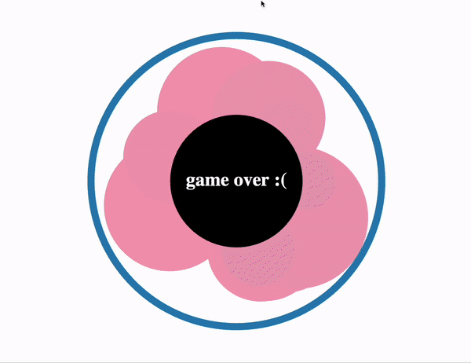

# WEBGL Game using Vanilla JS, CSS, and WebGL

A really simple implemenation of a 'clicker' type of game. The goal is the kill as many bacteria colonies as your can before one of them gets too big 🦠💉🧼

This project was an exercise in building fully functional game using no external libraries or tools. Its vanilla JS, CSS, & WebGl from the score counter right down to the vertex shaders. 

## Technical Insights

This game was devloped in order to gain technical insights and experience with WebGL:

- [Shader Programming](https://github.com/strawberriesAreGreat/Basic-Webgl-Game/blob/main/js/initShaders.js): I utilized vertex and fragment shaders to render basic 2D polygons(just circles for this prohect)🟧🔺🔵

- [Real-time Collision Detection](https://github.com/strawberriesAreGreat/Basic-Webgl-Game/blob/main/js/collisionDetect.js): I implemented a crude (and partially broken) collision detection algorithms to ensure realistic interactions between game objects 💥💥💥

- **WebGL Debugging**: Debugging was a challenge with WebGL when first attempting to get shaders working properly ⛱️

- **Handling Game Events**: Interactivity was achieved with user events 👉🏻

## Play the Game

To experience the game for yourself, just clone the repo and launch the home.html page in any old browser

## TODO

Things I ought to do, if I ever touch this project again:

- [ ] Refactor all the code, it really needs to be cleaned up
- [ ] get antibiotics to work again (it was depricated during some refactoring and is currently broken)
- [ ] add complexity to the algorithm that dictates the rate at which bacteria spawn
- [ ] Move over to typescript
